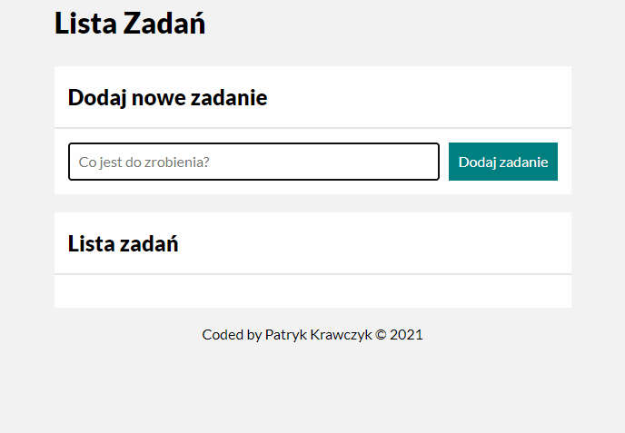

# To Do List

- Author: Patryk Krawczyk
- Created: 20-08-2021
- Updated: 29-08-2021

# Demo
[Here you find demo](kraviecdev.github.io/to-do-list/)
# Description
This project allows to make shopping list, activities list etc.
In this project I used tables, objects and arrow functions.
# How to use
1. In the *Co jest do zrobienia?* area write down what you want to add to the list
2. Press the *Dodaj zadanie* button
3. Your list item is below in *Lista zadań* section
4. You can mark your list item as done by left button (task)
5. You can delete your list item by right button (trash)
6. You can mark all list items as done by button *Wykonaj wszystkie*
7. You can hide all marked as done items by button *Ukryj wykonane*
8. You can show all marked as done items by button *Pokaż wykonane*

# Technologies

- HTML
- BEM
- CSS
- Flex
- Transition
- Media query
- JS/ES6+
- Immutability
